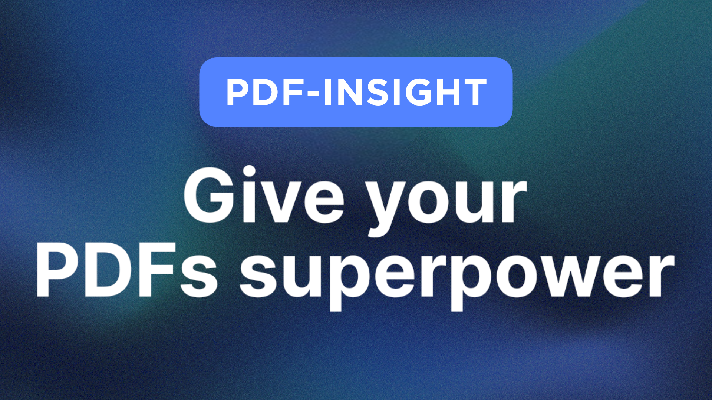

# Pdf-insight - The Ai Web-App for you to talk with your PDFs

Built with the Next.js 14 App Router, tRPC, TypeScript, Prisma & Tailwind

UI created using Shadcn



## Features

- 🛠️ Complete SaaS Built From Scratch
- 💻 Beautiful Landing Page & Pricing Page Included
- 💳 Free & Pro Plan Using Stripe
- 📄 A Beautiful And Highly Functional PDF Viewer
- 🔄 Streaming API Responses in Real-Time
- 🔒 Authentication Using Kinde
- 🎨 Clean, Modern UI Using 'shadcn-ui'
- 🚀 Optimistic UI Updates for a Great UX
- ⚡ Infinite Message Loading for Performance
- 📤 Intuitive Drag n’ Drop Uploads
- ✨ Instant Loading States
- 🔧 Modern Data Fetching Using tRPC & Zod
- 🧠 LangChain for Infinite AI Memory
- 🌲 Pinecone as our Vector Storage
- 📊 Prisma as our ORM
- 🔤 100% written in TypeScript
- 🎁 ...much more

## Getting started

To get started with this project, run

```bash
  git clone https://github.com/Faizan711/pdf-insight.git
```

and copy the .env.example variables into a separate .env file, fill them out & and that's all you need to get started!

Install the dependencies by running

```bash
npm install
# or
yarn install
# or
pnpm install
# or
bun install
```

Lastly, run the development server:

```bash
npm run dev
# or
yarn dev
# or
pnpm dev
# or
bun dev
```

Open [http://localhost:3000](http://localhost:3000) with your browser to see the result.

## Learn More

To learn more about Next.js, take a look at the following resources:

- [Next.js Documentation](https://nextjs.org/docs) - learn about Next.js features and API.
- [Learn Next.js](https://nextjs.org/learn) - an interactive Next.js tutorial.

